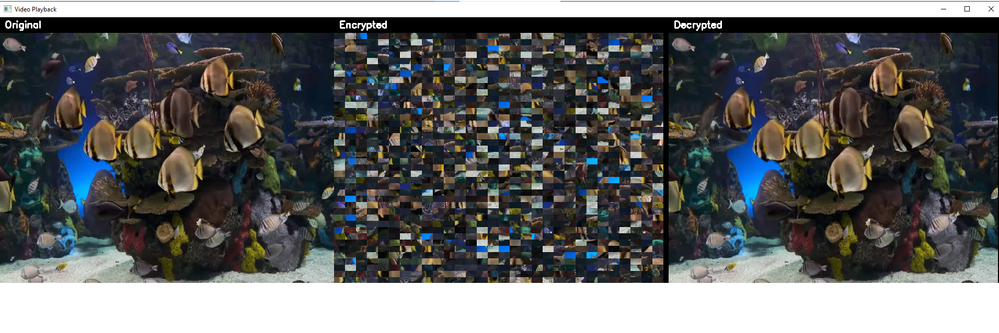
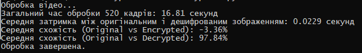

# Video Encryption Python

## Опис
Цей проєкт реалізує шифрування та дешифрування відео за допомогою Python та OpenCV. Кожен кадр відео сегментується на блоки, які переставляються за допомогою псевдовипадкового алгоритму (LFSR), щоб зашифрувати відео. Програма також підтримує дешифрування та відображення оригінального, зашифрованого та дешифрованого відео в реальному часі.

**Автор**: [Denys Pylypenko] ([PI-41 mp]) 
**Дата**: 20 April 2025

## Вимоги
Для запуску програми вам потрібно встановити наступне програмне забезпечення та бібліотеки:

- **Python 3.6+**: Переконайтеся, що у вас встановлена версія Python 3.6 або новіша.
- **Бібліотеки Python**:
  - `opencv-python` (для обробки відео та зображень)
  - `numpy` (для роботи з масивами)
  pip install opencv-python numpy
- Відеофайл у форматі MP4 (наприклад, `test_video.mp4`).

## Підготовка відеофайлу
- Підготуйте відеофайл у форматі MP4 (наприклад, `test_video.mp4`).
- Помістіть відеофайл у ту саму папку, де знаходиться файл `video_encryption.py`.

## Запуск програми
1. **Перейдіть до папки проєкту**:
- Відкрийте командний рядок і перейдіть до папки проєкту:

2. **Запустіть скрипт**:

3. **Що очікувати**:
- Програма завантажить відеофайл `test_video.mp4`.
- Відкриється вікно `Video Playback`, у якому відображатимуться три зображення:
- **Original**: оригінальний кадр.
- **Encrypted**: зашифрований кадр.
- **Decrypted**: дешифрований кадр.
- Кожні 30 кадрів у консолі виводитимуться значення схожості між оригінальним і зашифрованим/дешифрованим кадрами:
Кадр 30: Similarity (Original vs Encrypted): X.XX%
Кадр 30: Similarity (Original vs Decrypted): Y.YY%
- Після завершення обробки всіх кадрів програма виведе підсумкові результати:
Загальний час обробки 250 кадрів: 10.50 секунд
Середня затримка між оригінальним і дешифрованим зображенням: 0.0420 секунд
Середня схожість (Original vs Encrypted): A.AA%
Середня схожість (Original vs Decrypted): B.BB%
Обробка завершена.

## Управління програмою
- **Закриття програми**:
- Натисніть клавішу `Esc`, щоб завершити відтворення відео.
- Або закрийте вікно `Video Playback`, щоб зупинити програму.

## Налаштування (опціонально)
Ви можете змінити параметри програми, відредагувавши файл `video_encryption.py`. Основні параметри знаходяться на початку функції `main()`:
- `seed = 44257`: Початкове значення для генерації псевдовипадкової послідовності (можна змінити на інше ціле число).
- `rows = 40`, `cols = 30`: Кількість рядків і стовпців для сегментації кадру (впливає на розмір блоків).
- `frame_rate = 30`: Частота кадрів для відтворення (зміна може вплинути на швидкість відтворення).
- `similarity_interval = 30`: Інтервал (у кадрах), через який обчислюється схожість.
- `display_interval = 2`: Інтервал (у кадрах), через який оновлюється відображення у вікні.

## Вирішення проблем
- **Помилка "Не вдалося завантажити відеофайл"**:
- Переконайтеся, що файл `test_video.mp4` знаходиться в тій самій папці, що й `video_encryption.py`.
- Перевірте, чи відеофайл не пошкоджений, спробувавши відкрити його у відеоплеєрі.
- **Відтворення зупиняється або повільне**:
- Збільште значення `display_interval` (наприклад, до 5), щоб рідше оновлювати вікно.
- Зменшіть розміри кадру (наприклад, змініть `target_h, target_w = 480, 640` на менші значення, наприклад, `240, 320`).
- **Помилка з бібліотеками**:
- Переконайтеся, що `opencv-python` і `numpy` встановлені коректно: pip show opencv-python numpy

## Скріншот роботи програми

"# Technical-Protection" 
"# Technical-Protection" 
